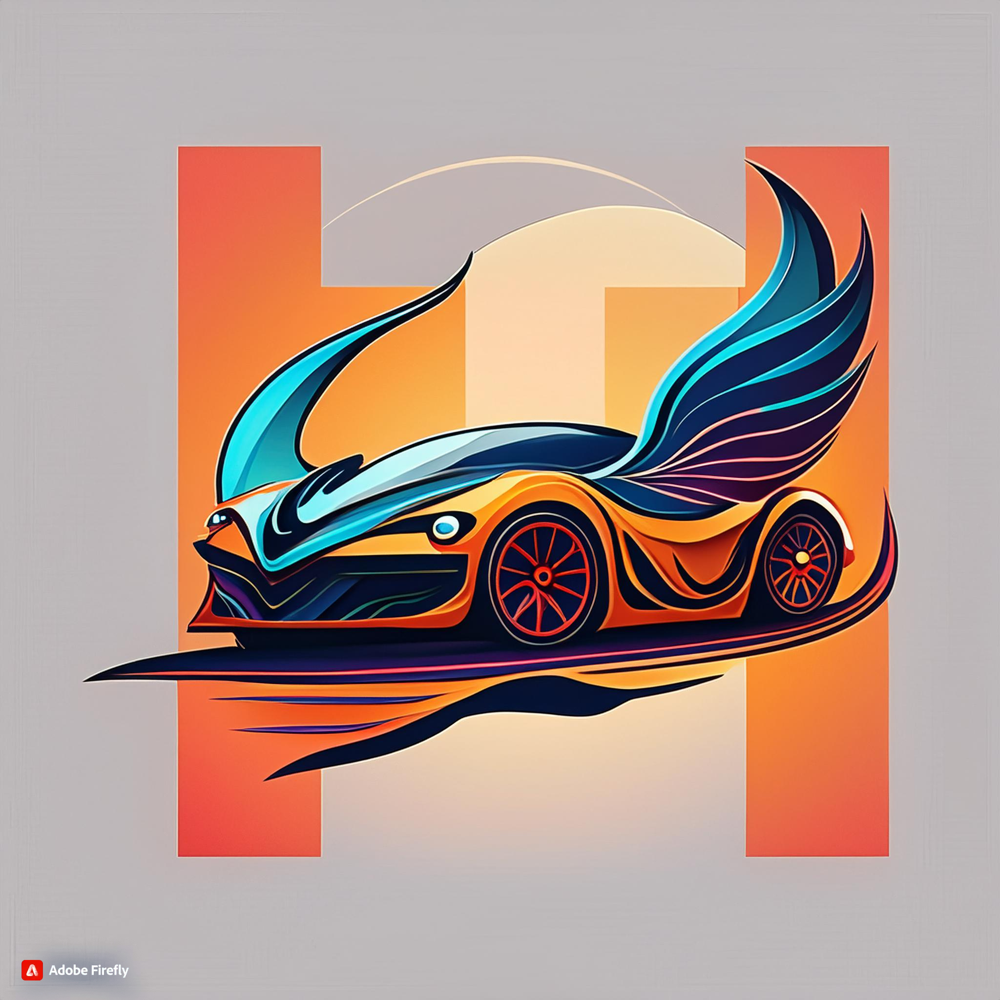
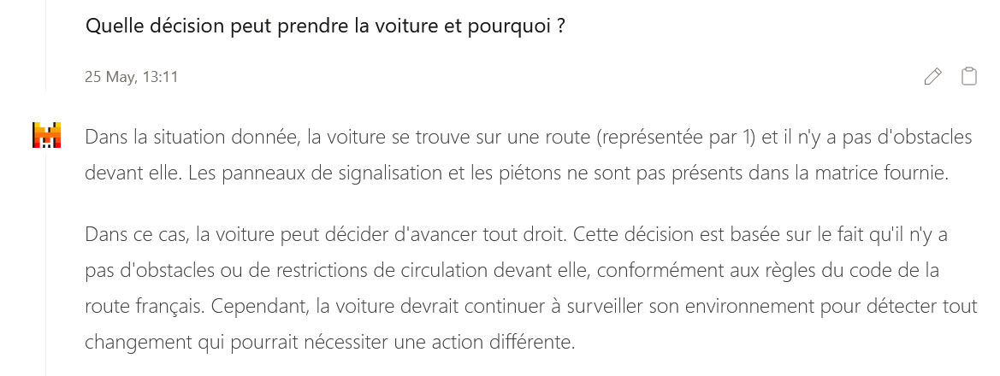

# Mistral Driver

The goal of this project is to find a way to use Mistral as an autonomous driving simulator. 

You can find all information and project videos on the Devpost page: [Mistral Driver](https://devpost.com/software/mistraldriver)

The project is divided into two parts: the first part is to create a simple autonomous driving simulator using pygame and the second part is to use Mistral as the autonomous driving simulator.

## Getting Started

Clone the repository and run the following command to install the required packages.

```
pip install -r requirements.txt
```

To use Mistral as the autonomous driving simulator, you need to provide a Mistral API key. You can get the API key by signing up on the Mistral website.

Create a .env file in the root directory and add the following line to the file.
```
MISTRAL_API_KEY=<your_mistral_api_key>
```

## Running the simulator

You can use two modes to run the simulator: manual and autonomous.

```
python main.py --mode=autonomous
```

The manual mode allows you to control the car using the arrow keys on the keyboard. 
Have fun ! 


The autonomous mode uses the Mistral API to control the car.


## Principle of the self-driving LLM agent

As itself, the LLM knows the theoretical aspect of driving rules :


However, the LLM agent is not able to translate this knowledge into action and drive by itself. It needs to be trained to learn how to drive.

This is why we chose to fine tune the Mistral model 7B base v3 to make it learn how to drive in the simulator. 
We used our simulator to generate complex and diverse fine-tuning data representing different driving situations : red lights, green lights, pedestrians, etc.

Once the model is fine-tuned, it is provided a custom prompt translating our 2D map into a textual representation of the driving situation. The model then predicts the action to take in this situation, among the following possibilities :
- "turn left"
- "turn right"
- "go straight"
- "stop"
- "turn back"

